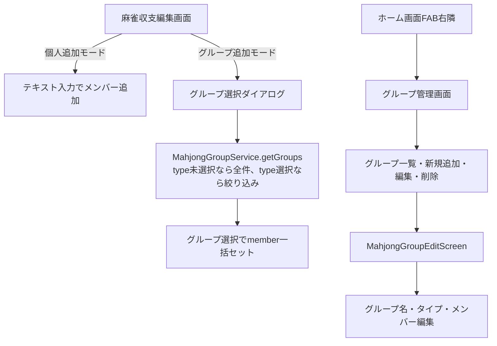

# 麻雀グループ機能の実装計画

## 概要

麻雀の収支記録において「グループ」機能を追加する。グループはメンバー一覧と麻雀タイプ（三麻/四麻）を持ち、収支記録時にメンバーをグループ単位 or 個人単位で追加できるようにする。

---

## 変更点の詳細

### 1. グループモデル

#### [NEW] `lib/models/mahjong_group.dart`
- プロパティ:
  - `id`: Firestore ドキュメントID
  - `name`: グループ名
  - `type`: 三麻 or 四麻 (MahjongResult.types に準ずる)
  - `members`: `List<String>` メンバー名リスト
  - `createdAt`: 作成日時

---

### 2. グループサービス

#### [NEW] `lib/services/mahjong/mahjong_group_service.dart`
- CRUD 操作:
  - `addGroup(MahjongGroup)`
  - `getGroups()` → `Stream<List<MahjongGroup>>`
  - `getGroupsByType(String type)` → `Stream<List<MahjongGroup>>`（type指定時のみフィルタ）
  - `updateGroup(MahjongGroup)`
  - `deleteGroup(String id)`
- Firestore コレクション名: `mahjong_groups`

---

### 3. グループ管理画面

#### [NEW] `lib/screens/edit/majong/mahjong_group_edit_screen.dart`
- グループ名・タイプ・メンバーを入力・編集できる画面
- メンバー追加UIはパチンコの台UIを参考に、番号付きボタン型グリッドで表示
  - 登録済みメンバーをグリッド表示（選択/解除トグル）
  - 「新規メンバー追加」ボタンでテキスト入力して追加
  - 選択されたメンバーはハイライト表示

---

### 4. 麻雀収支編集画面の変更

#### [MODIFY] `lib/screens/edit/majong/mahjong_edit_screen.dart`
- メンバー追加セクションに「個人追加」と「グループから追加」の切り替えを追加
- 既に個人が追加されている場合はグループ追加不可（逆も同様）
- グループ選択時:
  - 選択したタイプと同じグループのみ表示（タイプ未選択なら全グループ表示）
  - グループ選択でメンバーを一括セット
- 追加方法トグル: `addMode = 'individual' | 'group' | null`

#### [MODIFY] `lib/screens/edit/base/base_edit_screen.dart`
- `buildMemberInput` は麻雀固有となるためデフォルト実装はそのまま残し、麻雀編集画面側でオーバーライド

---

### 5. ホーム画面のFAB変更

#### [MODIFY] `lib/screens/home_screen.dart`
- 麻雀タブのみ、FABの右隣にグループ管理用の小さいFAB（`FloatingActionButton.small`）を追加
  - `FloatingActionButton.extended` または `Column`/`Row` でFABを並べる
  - グループ管理画面への遷移

---

## データフロー

---

## UIの詳細

### グループ管理画面のメンバーUI（パチンコ台UI参考）
- パチンコの台番号グリッドのように、メンバーを番号/名前付きのカードボタンとして並べる
- 選択済み: 色付き背景 + チェックアイコン
- 未選択: グレー背景
- 「+ 新規追加」ボタンでその場でメンバー名を入力・追加

### グループ選択UI（収支登録画面）
- BottomSheet または ダイアログでグループ一覧をカード表示
- カード内に: グループ名、タイプバッジ、メンバー数

---

## 実装順序

1. `MahjongGroup` モデル
2. `MahjongGroupService`
3. `MahjongGroupEditScreen`（グループ管理）
4. `mahjong_edit_screen.dart` の個人/グループ追加切り替えUI
5. `home_screen.dart` のFAB変更
6. 静的解析エラー修正

---

## 検証計画

### 自動テスト
- `flutter analyze` でエラー0を確認

### 手動確認
- グループ追加・編集・削除が正常に動作する
- 個人追加済みの場合にグループ追加ボタンが無効化される
- グループ追加済みの場合に個人追加ボタンが無効化される
- タイプ選択時に対応するグループのみ表示される
- ホーム画面でFABとグループ管理ボタンが麻雀タブのみ表示される
